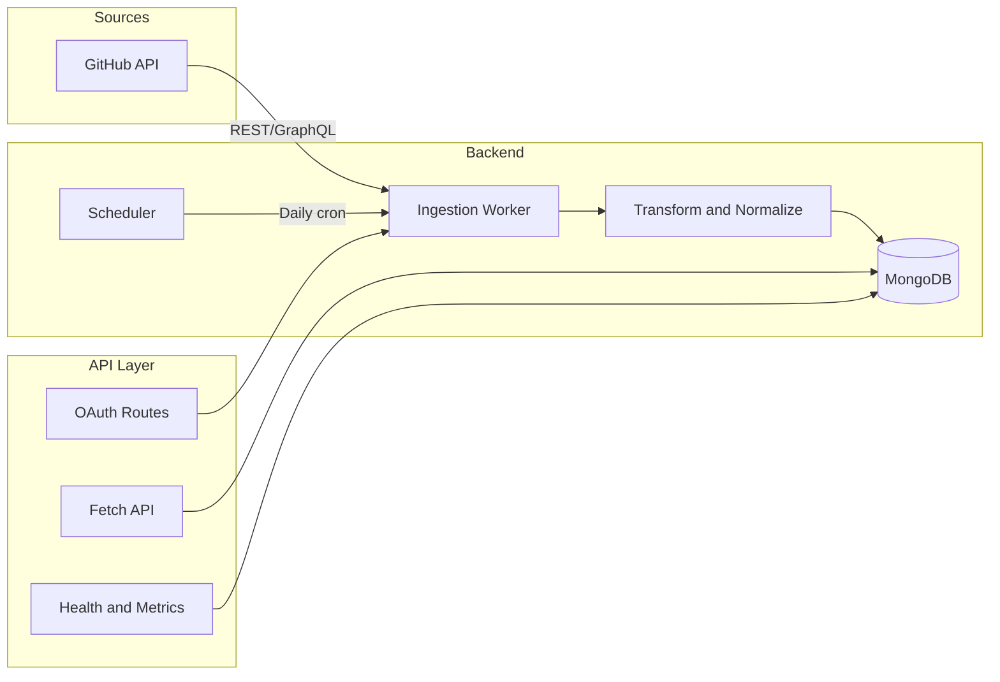

# Data Integration Hub – Implementation Plan

## Summary of feat1.md

The PRD defines a **centralized ingestion pipeline** that:

- Unifies data from GitHub/GitLab, Jira, CI/CD (e.g. GitHub Actions), and Slack
- Delivers normalized, deduplicated, auditable, and queryable data
- Supports OAuth 2.0 (GitHub/GitLab), API tokens (Jira), daily sync, and optional near-real-time webhooks
- Requires schema normalization, idempotency/deduplication, retries with exponential backoff, circuit breaker, audit logging, and metrics

Your repo already has: **Express + MongoDB (Mongoose)** in [server/](Datathon-2026/server/) and **React 19 + Vite + TypeScript + Tailwind + shadcn** in [client/](Datathon-2026/client/). The plan builds on this stack and follows the PRD’s **rollout**: MVP with one source (GitHub), then add Jira, CI/CD, and Slack.

---

## Architecture (MVP)




---

## Phase 1: Foundation (Data models, config, health/metrics)

**1.1 Environment and secrets**

- Extend [server/config/env.js](Datathon-2026/server/config/env.js) (or use `.env` only) for: `GITHUB_CLIENT_ID`, `GITHUB_CLIENT_SECRET`, `GITHUB_CALLBACK_URL`, `JWT_SECRET` (for session/token after OAuth), `NODE_ENV`.
- Document in README or `.env.example`; no secrets in code.

**1.2 MongoDB models (Mongoose)**  
Create under `server/models/` and register in the app:

- **User** (PRD §6.1): `user_id` (string, unique), `source` (enum: GitHub, GitLab, Jira, Slack), `display_name`, `email`. Optional: `source_user_id` for mapping.
- **Commit** (PRD §6.2): `commit_id` (SHA), `branch`, `author_id` (ref User), `timestamp`, `source`, `raw_signature` (for dedup). Index on `(source, commit_id)` for idempotency.
- **SyncState**: `source`, `entity` (e.g. `commits`), `last_sync_at`, `last_cursor` (for pagination). One doc per (source, entity).
- **AuditLog** (PRD §4.6): `source`, `entity`, `action` (e.g. `ingest`), `outcome` (success/fail), `payload_size`, `timestamp`, optional `raw_payload` (configurable).
- **IngestionMetric** (or use a simple metrics collection): `source`, `entity`, `success_count`, `fail_count`, `latency_ms`, `ts` (bucket e.g. per hour). Alternatively expose only in-memory metrics for MVP and persist later.

**1.3 Health and metrics API (PRD §7.3)**

- In [server/routes/index.js](Datathon-2026/server/routes/index.js): keep `GET /api/health` and add DB check (e.g. ping MongoDB).
- Add `GET /api/metrics`: return JSON with success/fail counts, last sync times (from SyncState), and optional latency. No auth for MVP if metrics are internal; later protect or restrict by IP.

---

## Phase 2: GitHub OAuth and fetch API

**2.1 OAuth 2.0 (GitHub)**  

- Add dependencies: `axios` (or `node-fetch`), `express-session` and `passport` + `passport-github2` (or manual OAuth with axios).
- Routes under `server/routes/oauth.js` (or `auth.js`):
  - `GET /api/oauth/github` → redirect to GitHub authorize URL (scopes: `repo`, `read:org`, `admin:repo_hook` as in PRD).
  - `GET /api/oauth/github/callback` → exchange code for tokens, store refresh token if needed, then store access token in session or in a small `OAuthCredential` collection (encrypted at rest in production).
- Mount routes in [server/index.js](Datathon-2026/server/index.js) under `/api`.

**2.2 Source fetch API (PRD §7.2)**

- New route file `server/routes/fetch.js`:
  - `GET /api/fetch/:source/:entity?since=&limit=`  
  - `source`: e.g. `github`; `entity`: e.g. `commits`, `issues`, `pull_requests`.
  - Query MongoDB (normalized collections) with filters based on `since` (timestamp) and `limit`, return `{ data: [...], next_cursor }`.
  - For MVP, only `github` and `commits` need to be implemented; others can 404 or return empty.

---

## Phase 3: Ingestion worker (GitHub commits)

**3.1 GitHub API client**

- `server/services/githubClient.js`: functions to fetch commits (REST or GraphQL) with pagination, using stored access token. Handle `Link` headers or cursor-based pagination. Apply rate-limit handling (respect `X-RateLimit-*` headers, back off when near limit).

**3.2 Ingestion service**

- `server/services/ingestion.js` (or `ingestion/githubCommits.js`):
  - Load last sync from SyncState for `github` / `commits`.
  - Fetch commits from GitHub (since `last_sync_at` or last cursor), page by page.
  - For each commit: compute deterministic key (e.g. `source + repo_id + commit_id`), check existing (Commit collection or in-memory set for batch); if duplicate, skip (idempotency).
  - Normalize to PRD schema: `commit_id`, `branch`, `author_id`, `timestamp`, `source`. Resolve or create User by `author_id` (e.g. GitHub login → internal `user_id`).
  - Write to Commit (and User if new); update SyncState; write AuditLog and metrics (success/fail, latency).
  - On failure: implement retry with exponential backoff (e.g. 5 retries, 1s/2s/4s/8s/16s) and circuit breaker (e.g. after N consecutive failures, stop for a cooldown). Use a small helper in `server/utils/retry.js`.

**3.3 Scheduler**

- Use `node-cron` in [server/index.js](Datathon-2026/server/index.js) (or a separate worker process): run ingestion for `github` / `commits` daily (e.g. 2 AM). Call ingestion service and catch errors; log and optionally increment fail metric.

---

## Phase 4: Error handling, audit, and hardening

**4.1 Retry and circuit breaker**

- `server/utils/retry.js`: `withRetry(fn, { maxAttempts: 5, backoff: 'exponential' })`.
- Optional `server/utils/circuitBreaker.js`: wrap GitHub API calls; open circuit after e.g. 5 consecutive failures; half-open after 60s.

**4.2 Audit logging**

- In ingestion flow: after each batch (or each commit), write to AuditLog: source, entity, action, outcome, timestamp. Optionally store raw API payload in AuditLog or in a separate `RawPayloads` collection (configurable, with retention policy later).

**4.3 Security**

- TLS: ensure production runs behind HTTPS (e.g. reverse proxy).
- Secrets: use env vars only; no tokens in repo. Optional: integrate with a vault later.
- RBAC: defer to a later phase; for MVP, protect admin/trigger endpoints with a simple API key or session check if needed.

---

## Phase 5: Client (minimal dashboard)

- Use existing [client/src/App.tsx](Datathon-2026/client/App.tsx) and add:
  - **Health**: call `GET /api/health` and show status (e.g. green/red).
  - **Metrics**: call `GET /api/metrics` and show last sync time per source/entity, success/fail counts (cards or table).
  - **OAuth**: button “Connect GitHub” linking to `GET /api/oauth/github`; after callback, show “Connected” and optionally repo selector for future use.
- Optional: page to trigger sync manually (e.g. `POST /api/sync/github/commits`) for testing; protect with API key or session.

---

---
name: Phase 6 Post-MVP Expansions
overview: "Implement Phase 6 from feat1.md: introduce a Bull+Redis queue for async ingestion and webhooks, add Jira (API token auth, Issue/Sprint models and ingestion), GitHub Actions webhook with Build model, and Slack (SlackEvent model and ingestion), following the existing SyncState/normalize/dedupe/audit pattern and keeping the API layer in the main app."
todos: []
isProject: false
---

# Phase 6: Post-MVP Expansions – Implementation Plan

## Scope (from [feat1.md](Datathon-2026/feat1.md) lines 148–153)

- **Jira**: API token auth; Issue + Sprint models; ingestion for issues/statuses; SyncState, normalize, dedupe, audit.
- **CI/CD (GitHub Actions)**: Webhook `POST /api/webhooks/github-actions`, signature validation, enqueue event; worker normalizes to Build model.
- **Slack**: Read-only; Event Subscriptions or Web API; normalize to SlackEvent model.
- **Queue**: Bull + Redis for webhooks and scalable ingestion; API stays in main app.

---

## Senior-engineering approach

1. **Introduce the queue first** so all new ingestion (webhooks and optional scheduled jobs) flows through one async path; the API remains thin and workers can scale independently.
2. **Reuse existing patterns**: [server/services/ingestion.js](Datathon-2026/server/services/ingestion.js) (SyncState, AuditLog, metricsStore, retry, circuit breaker) and [server/routes/fetch.js](Datathon-2026/server/routes/fetch.js) (source/entity routing) are the templates for Jira and for query APIs.
3. **Explicit models and idempotency**: Each new entity (Issue, Sprint, Build, SlackEvent) gets a normalized Mongoose model and a deterministic `raw_signature` (or equivalent) for deduplication.
4. **Security**: Webhook signature verification (GitHub: `X-Hub-Signature-256`), secrets in env only, no credentials in repo.

---

## Architecture (post–Phase 6)

```mermaid
flowchart TB
  subgraph api [API Layer - main app]
    OAuth[OAuth]
    Fetch[Fetch API]
    Sync[Sync Trigger]
    Webhooks[Webhooks]
    Health[Health and Metrics]
  end
  subgraph queue [Queue]
    Bull[Bull with Redis]
  end
  subgraph workers [Workers]
    GitHubIngest[GitHub Commits]
    JiraIngest[Jira Issues/Sprints]
    BuildWorker[Build from GA webhook]
    SlackWorker[Slack Events]
  end
  subgraph store [(MongoDB)]
    Models[Commit, Issue, Sprint, Build, SlackEvent, SyncState, AuditLog]
  end
  Webhooks -->|enqueue| Bull
  Sync -->|enqueue or direct| Bull
  Cron[Cron] -->|enqueue| Bull
  Bull --> GitHubIngest
  Bull --> JiraIngest
  Bull --> BuildWorker
  Bull --> SlackWorker
  GitHubIngest --> Models
  JiraIngest --> Models
  BuildWorker --> Models
  SlackWorker --> Models
  Fetch --> Models
  Health --> Models
```


---

## Phase 6.1: Queue (Bull + Redis)

**Goal:** All async ingestion goes through Bull so the HTTP server stays fast and workers can be scaled or run in a separate process later.

- **Dependencies:** `bull` (or `bullmq`), `ioredis` (or use Redis URL with Bull default). Add to [server/package.json](Datathon-2026/server/package.json).
- **Config:** Add `REDIS_URL` (e.g. `redis://localhost:6379`) to [server/config/env.js](Datathon-2026/server/config/env.js) and [server/.env.example](Datathon-2026/server/.env.example).
- **Queue module:** Create `server/queue/index.js` (or `server/jobs/queue.js`):
  - Connect to Redis using REDIS_URL; if missing or connection fails, log and optionally no-op (or fail startup in production).
  - Define job types: e.g. `ingest:github:commits`, `ingest:jira:issues`, `ingest:jira:sprints`, `ingest:github-actions:build`, `ingest:slack:events`.
  - Export `addJob(name, data)` and, in the same process, `startWorkers()` that process these jobs by calling the corresponding ingestion functions.
- **Refactor existing cron:** In [server/index.js](Datathon-2026/server/index.js), instead of calling `runIngestion(repo)` directly, enqueue `ingest:github:commits` with `{ repoId }`. A worker in the same process (or a separate worker process) runs the job and calls the existing [server/services/ingestion.js](Datathon-2026/server/services/ingestion.js) `runIngestion(repoId)`.
- **Sync route:** [server/routes/sync.js](Datathon-2026/server/routes/sync.js) can either keep calling `runIngestion` directly for simplicity or enqueue the same job for consistency; recommend enqueue so all paths go through the queue.

---

## Phase 6.2: GitHub Actions webhook and Build model

**Goal:** Receive workflow_run (and optionally workflow_job) events, validate signature, enqueue, persist as Build.

- **Build model:** Create `server/models/Build.js`:
  - Fields: `build_id` (unique, e.g. `github_actions:${repoId}:${runId}`), `source: 'github_actions'`, `repo_id`, `workflow_name`, `workflow_id`, `run_id`, `status`, `conclusion`, `created_at`, `updated_at`, `raw_signature` for idempotency. Index on `raw_signature` (unique) and `source, created_at`.
- **Webhook route:** Create `server/routes/webhooks.js`:
  - `POST /api/webhooks/github-actions`: raw body required for signature check. Use `express.raw({ type: 'application/json' })` for this route only. Verify `X-Hub-Signature-256` with `GITHUB_WEBHOOK_SECRET` (crypto.timingSafeEqual). Parse JSON, filter for `workflow_run` (and optionally `workflow_job`) events, enqueue job `ingest:github-actions:build` with payload. Respond 200 quickly.
- **Env:** Add `GITHUB_WEBHOOK_SECRET` to env and .env.example.
- **Worker:** In queue worker for `ingest:github-actions:build`, normalize payload to Build schema (run_id, conclusion, status, timestamps, repo, workflow name), dedupe by `raw_signature`, insert Build, write AuditLog, record metrics. Use existing [server/utils/retry.js](Datathon-2026/server/utils/retry.js) and [server/utils/metricsStore.js](Datathon-2026/server/utils/metricsStore.js).
- **Mount:** Mount webhooks router in [server/routes/index.js](Datathon-2026/server/routes/index.js) under `/api/webhooks` (so URL is `/api/webhooks/github-actions`). Ensure the webhook route uses the raw body middleware; other routes keep `express.json()`.

---

## Phase 6.3: Jira (issues and sprints)

**Goal:** Pull-based ingestion for Jira issues and sprints with API token auth; same SyncState/normalize/dedupe/audit pattern.

- **Config:** Add `JIRA_BASE_URL`, `JIRA_EMAIL`, `JIRA_API_TOKEN` to [server/config/env.js](Datathon-2026/server/config/env.js) and .env.example. (Alternative: store in a small ApiCredential collection for multi-tenant later; for single-tenant, env is sufficient.)
- **Models:**
  - `server/models/Issue.js`: `issue_id` (e.g. Jira key), `source: 'jira'`, `project_key`, `summary`, `status`, `story_points`, `assignee_id` (ref User), `created_at`, `updated_at`, `raw_signature`. Unique index on `raw_signature`.
  - `server/models/Sprint.js`: `sprint_id`, `source: 'jira'`, `board_id`, `name`, `state`, `start_date`, `end_date`, `raw_signature`. Unique index on `raw_signature`.
- **Jira client:** Create `server/services/jiraClient.js`:
  - Use Basic Auth (email + API token) or Bearer if using personal access token. Functions: `fetchIssues(opts)` (Jira search API, pagination), `fetchSprints(boardId)` (agile API). Handle 401/403 and rate limits; use [server/utils/retry.js](Datathon-2026/server/utils/retry.js) and optionally a circuit breaker per source.
- **Ingestion:** Create `server/services/jiraIngestion.js` (or split into `jiraIssues.js` and `jiraSprints.js`):
  - `runJiraIssuesIngestion()`: load SyncState for `jira`/`issues`, fetch issues (JQL by updated date or pagination), normalize to Issue schema, resolve/create User for assignee, dedupe by raw_signature, bulk write, update SyncState, AuditLog, metrics.
  - `runJiraSprintsIngestion(boardId)`: similar for sprints; SyncState for `jira`/`sprints`.
  - Reuse the same pattern as [server/services/ingestion.js](Datathon-2026/server/services/ingestion.js) (SyncState, AuditLog, recordIngestion).
- **Queue jobs:** Register `ingest:jira:issues` and `ingest:jira:sprints`; workers call the two ingestion functions.
- **Cron:** Schedule daily (or configurable) jobs for Jira issues and sprints in [server/index.js](Datathon-2026/server/index.js) (enqueue to Bull).
- **Sync route:** Add `POST /api/sync/jira/issues` and `POST /api/sync/jira/sprints` in [server/routes/sync.js](Datathon-2026/server/routes/sync.js) (enqueue job or call ingestion directly).
- **Fetch API:** Extend [server/routes/fetch.js](Datathon-2026/server/routes/fetch.js) to support `source=jira`, `entity=issues` and `entity=sprints`; query Issue and Sprint collections with `since`/`limit`/cursor, same response shape `{ data, next_cursor }`.

---

## Phase 6.4: Slack (SlackEvent model and ingestion)

**Goal:** Read-only Slack data; normalize to SlackEvent; support either Web API poll or Event Subscriptions (webhook).

- **Model:** Create `server/models/SlackEvent.js`: `event_id` (unique), `source: 'slack'`, `channel_id`, `channel_name`, `type` (e.g. message, deploy_notification), `user_id` (ref User or string), `timestamp`, `payload` (optional JSON), `raw_signature`. Index on `raw_signature`, `source, timestamp`.
- **Config:** Add `SLACK_BOT_TOKEN` (and optionally `SLACK_SIGNING_SECRET` for events) to env and .env.example.
- **Option A – Web API poll:** Create `server/services/slackClient.js` (conversations.history or similar), `server/services/slackIngestion.js`: load SyncState for `slack`/`events`, fetch messages/events since last cursor, normalize to SlackEvent, dedupe, write, update SyncState, AuditLog, metrics. Schedule via cron (enqueue job `ingest:slack:events`).
- **Option B – Event Subscriptions:** Create webhook `POST /api/webhooks/slack`: verify signing secret, enqueue `ingest:slack:events` with body; worker normalizes and writes SlackEvent. Prefer Option B for “deploy notifications” and real-time; Option A for simple read-only history.
- **Fetch API:** Extend [server/routes/fetch.js](Datathon-2026/server/routes/fetch.js) for `source=slack`, `entity=events`; query SlackEvent with since/limit/cursor.

---

## Phase 6.5: Shared harness and fetch extension

- **Optional refactor:** Introduce a small shared helper (e.g. `server/services/ingestionHarness.js`) that accepts `{ source, entity, fetchPage, normalize, dedupeKey, model }` and runs the loop (SyncState, fetch, normalize, dedupe, write, AuditLog, metrics). Current [server/services/ingestion.js](Datathon-2026/server/services/ingestion.js) and Jira/Slack ingestion can call this to reduce duplication. Not mandatory for Phase 6 but recommended for long-term maintainability.
- **Fetch route:** [server/routes/fetch.js](Datathon-2026/server/routes/fetch.js) already branches on `source` and `entity`. Add branches for `jira`/`issues`, `jira`/`sprints`, `github_actions`/`builds` (or `builds`), `slack`/`events`; each branch queries the corresponding model with sort/limit/cursor and returns `{ data, next_cursor }`.

---

## Phase 6.6: Client and operations

- **Dashboard:** Extend [client/src/App.tsx](Datathon-2026/client/App.tsx) (or add a settings/sources page): show Jira “connected” (e.g. if JIRA_API_TOKEN is set or via a simple status endpoint), Slack “connected”, and last sync / metrics for `jira:issues`, `jira:sprints`, `github_actions:builds`, `slack:events` from existing `GET /api/metrics`. Optionally “Trigger sync” for Jira/Slack (calls new sync endpoints).
- **Health:** Optionally include Redis connectivity in `GET /api/health` (e.g. ping Redis); if Redis is down, report degraded and skip enqueue or fail job processing.

---

## File summary


| Area     | New or changed files                                                                                                                                         |
| -------- | ------------------------------------------------------------------------------------------------------------------------------------------------------------ |
| Queue    | `server/queue/index.js` (or `server/jobs/queue.js`), env REDIS_URL                                                                                           |
| Build    | `server/models/Build.js`                                                                                                                                     |
| Webhooks | `server/routes/webhooks.js` (github-actions + slack), mount in routes/index.js, raw body for GH                                                              |
| Jira     | `server/config/env.js` (Jira vars), `server/models/Issue.js`, `server/models/Sprint.js`, `server/services/jiraClient.js`, `server/services/jiraIngestion.js` |
| Slack    | `server/models/SlackEvent.js`, `server/services/slackClient.js`, `server/services/slackIngestion.js`, webhook or cron                                        |
| Fetch    | Extend `server/routes/fetch.js` for jira/issues, jira/sprints, builds, slack/events                                                                          |
| Sync     | Extend `server/routes/sync.js` for jira/issues, jira/sprints; optional slack trigger                                                                         |
| App      | `server/index.js` (cron enqueues; start workers); client dashboard additions                                                                                 |


---

## Implementation order

1. **Queue (6.1):** Redis + Bull, job types, refactor cron and sync to enqueue; worker runs existing GitHub commits ingestion.
2. **Build + GitHub Actions webhook (6.2):** Model, webhook route with signature verification, worker for Build.
3. **Jira (6.3):** Config, Issue/Sprint models, jiraClient, jiraIngestion, queue jobs, sync and fetch routes, cron.
4. **Slack (6.4):** SlackEvent model, slackClient + slackIngestion (poll) and/or Slack webhook, queue job, fetch route.
5. **Harness (6.5) and client (6.6):** Optional refactor; dashboard and health updates.

This keeps the API in the main app, moves heavy work through the queue, and reuses your existing patterns for SyncState, normalization, deduplication, and audit.

---

## Key files to add or change


| Area      | Path                                                                | Purpose                           |
| --------- | ------------------------------------------------------------------- | --------------------------------- |
| Config    | `server/config/env.js`                                              | Add GitHub OAuth and app secrets  |
| Models    | `server/models/User.js`, `Commit.js`, `SyncState.js`, `AuditLog.js` | Mongoose schemas                  |
| OAuth     | `server/routes/oauth.js`                                            | GitHub OAuth flow                 |
| API       | `server/routes/fetch.js`                                            | GET /api/fetch/:source/:entity    |
| Ingestion | `server/services/githubClient.js`, `server/services/ingestion.js`   | GitHub client and sync logic      |
| Utils     | `server/utils/retry.js`                                             | Exponential backoff wrapper       |
| Scheduler | `server/index.js`                                                   | node-cron daily job               |
| Client    | `client/src/App.tsx` or new pages                                   | Health, metrics, “Connect GitHub” |


---

## Dependencies to add (server)

- `passport`, `passport-github2`, `express-session` (OAuth)
- `axios` (GitHub API and token exchange)
- `node-cron` (scheduler)

---

## Testing (PRD §13)

- Unit: normalize functions (e.g. GitHub commit → Commit document) with Jest.
- Integration: mock GitHub API (e.g. `nock` or MSW) and run ingestion; assert Commit and SyncState updates.
- Load: optional; use k6 or Artillery for GET /api/fetch and GET /api/health later.

---

## Open points (from PRD §15)

- **Queue**: MVP without queue; add Redis+Bull or SQS when introducing webhooks or multiple workers.
- **Raw payload retention**: store in AuditLog or separate collection with a TTL index (e.g. 90 days); make it configurable.
- **Self-hosted sources**: out of scope for MVP; design source config (e.g. base URL + token) so GitLab/Jira Cloud and self-hosted can be added later.

This plan delivers the MVP described in feat1.md (GitHub ingestion, normalized store, OAuth, fetch API, health/metrics, dedup, retries, audit) on your existing stack and sets a clear path for Jira, CI/CD, and Slack.